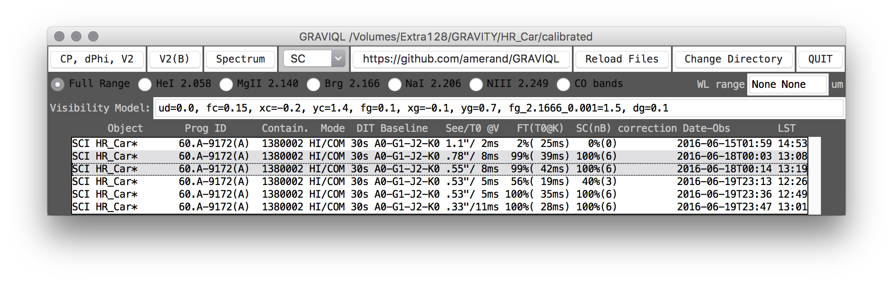

# VLTI/GRAVITY reduced and calibrated data Quick Look

A Python2.7 Tkinter GUI aimed at visualizing VLTI/GRAVITY reduced and calibrated data.

## Overview

Run [gravi_quick_look.py](gravi_quick_look.py) as a script and select a directory (alternatively, a directory can be given as an argument). The GUI will look like this: 
* The bottom part of the GUI contains the list of files which can be selected for display, either individually, or averaged. Colored lines are for SCI and white lines are for CAL. The alternating colors group the observations by containers (if relevant). Object' names followed by a ''\*'' indicate data which are reduced/calibrated (as opposed to simply reduced data).

* The top rows allow to start show the data plots (in matplotlib). Note the spectra are roughly corrected for telluric features using a synthetic atmospheric model for 2.0mm of water vapor. Spectral ranges can be selected using buttons or by manually entering the range as the boundaries (in um) separated by a space.

## Limitations
* Tested on MEDIUM and HIGH dispersion modes only.
* Telluric correction is very approximative and only indicative.
* Tested on Anaconda/MacOS (does not work) and Anaconda/Linux (works). Running on the MacOS native python is a possibility, but astropy would have to be manually installed. 

## Dependencies

* Numpy, Matplotlib and Astropy. GUI in Tkinter (standard library).
